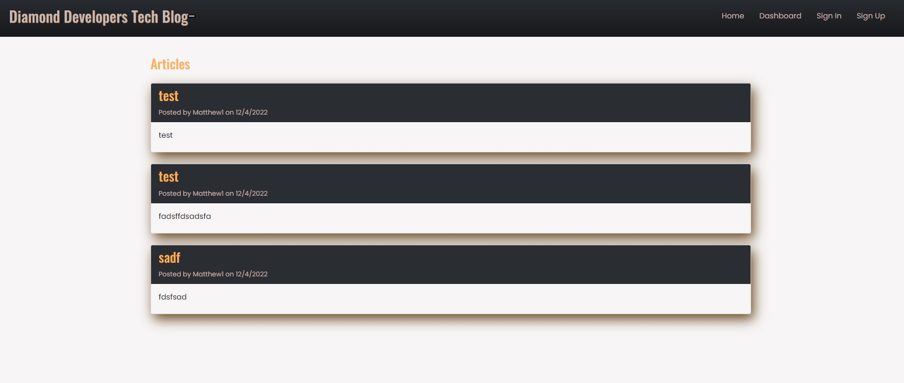
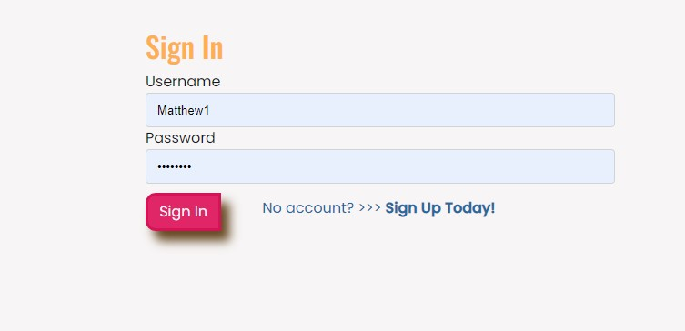
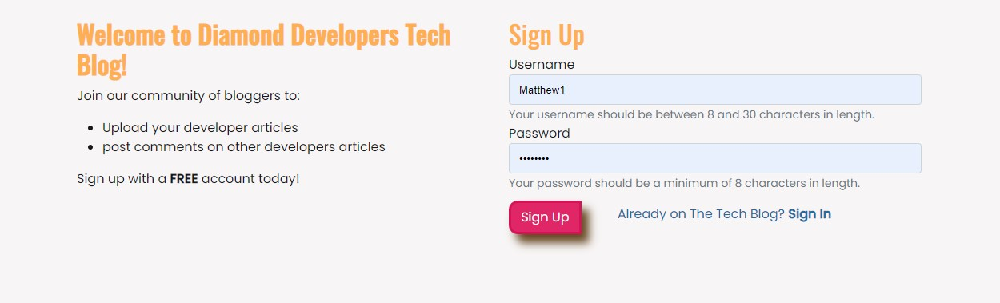
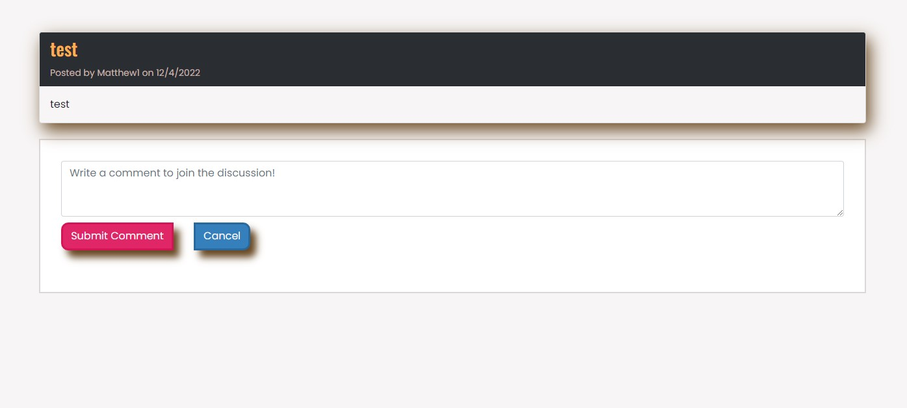

# Diamond Developers Tech Blog

## Description

A community of developers who can write blogs about code or ask questions. Built out of a need for developers have a nice simple platform, rather than the complex ones out there in the marketplace, this assignment was challenging as had to do the front and backend from scratch using tech that I am still getting used too.

## Technologies used

- bcrypt
- sequelize
- cookies
- dotenv
- express
- express-handlebars
- express-session
- handlebars
- ics
- mysql2
- session
- router

## Table of Contents

- [Installation](#installation)
- [Usage](#usage)
- [Credits](#credits)
- [License](#license)

## Installation

Visit https://diamond-developers-tech-blog.herokuapp.com/ to use this app.

## Usage

- homepage screenshot

- Signin page Screenshot

- sign up page

- add/display comment page

## Credits

- MDN web docs
- W3schools
- sequalize docs
- handlebars docs
- sql docs

## License

MIT License

Copyright (c) 2022 breakfireaus, auralize & asish-dewan

Permission is hereby granted, free of charge, to any person obtaining a copy
of this software and associated documentation files (the "Software"), to deal
in the Software without restriction, including without limitation the rights
to use, copy, modify, merge, publish, distribute, sublicense, and/or sell
copies of the Software, and to permit persons to whom the Software is
furnished to do so, subject to the following conditions:

The above copyright notice and this permission notice shall be included in all
copies or substantial portions of the Software.

THE SOFTWARE IS PROVIDED "AS IS", WITHOUT WARRANTY OF ANY KIND, EXPRESS OR
IMPLIED, INCLUDING BUT NOT LIMITED TO THE WARRANTIES OF MERCHANTABILITY,
FITNESS FOR A PARTICULAR PURPOSE AND NONINFRINGEMENT. IN NO EVENT SHALL THE
AUTHORS OR COPYRIGHT HOLDERS BE LIABLE FOR ANY CLAIM, DAMAGES OR OTHER
LIABILITY, WHETHER IN AN ACTION OF CONTRACT, TORT OR OTHERWISE, ARISING FROM,
OUT OF OR IN CONNECTION WITH THE SOFTWARE OR THE USE OR OTHER DEALINGS IN THE
SOFTWARE.